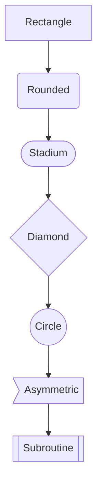
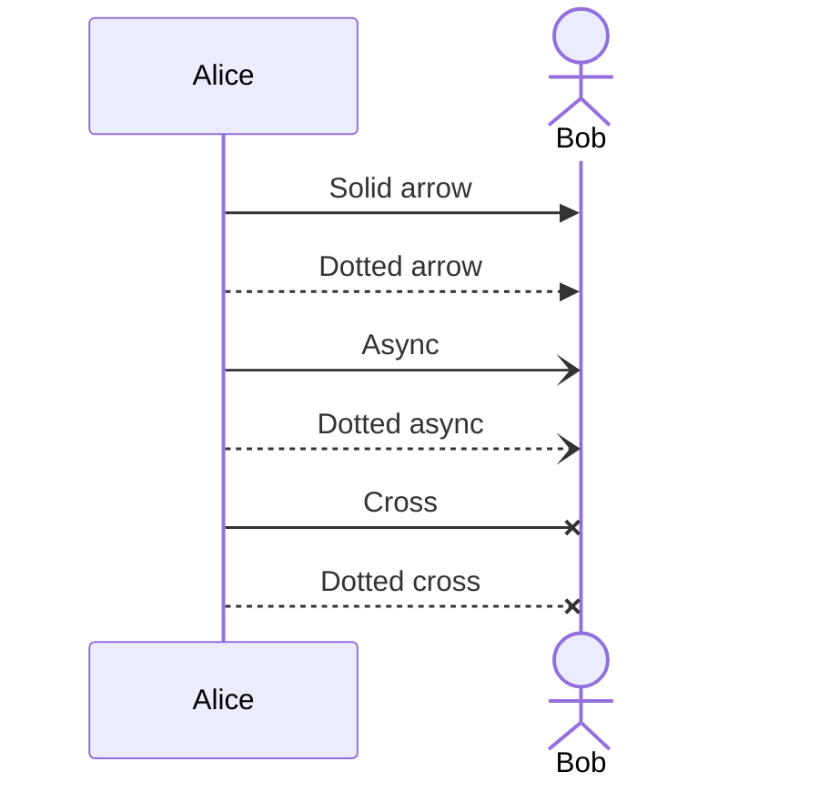
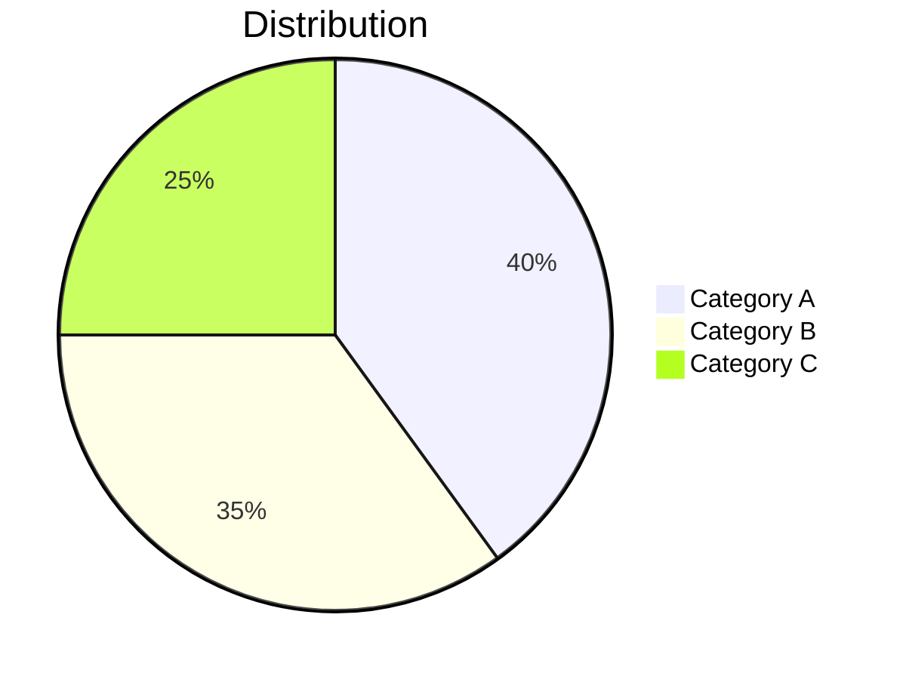

# Mermaid-iOS

Pure Swift Mermaid diagram renderer for iOS — no JavaScript, no WKWebView, no external dependencies.

Parses [Mermaid](https://mermaid.js.org/) diagram syntax and renders to `CGImage` using CoreGraphics.

<p align="center">
  
</p>

## Features

- **Zero dependencies** — pure Swift + CoreGraphics, no CocoaPods/SPM packages needed
- **No WebView** — renders natively, works in background threads and extensions
- **Three diagram types**: Flowcharts, Sequence Diagrams, Pie Charts
- **Full flowchart support**: 7 node shapes, 4 edge styles, edge labels, all directions (TD/TB/BT/LR/RL)
- **Sequence diagrams**: Participants, actors, 6 message arrow styles, lifelines
- **Pie charts**: Titled, decimal values, color-coded slices with legend
- **PNG export**: Render directly to `Data` for saving or sharing
- **2x Retina rendering** out of the box

## Quick Start

### Requirements

- Xcode 16+ 
- iOS 17+
- [xcodegen](https://github.com/yonaskolb/XcodeGen) (`brew install xcodegen`)

### Setup

```bash
git clone https://github.com/hggz/Mermaid-iOS.git
cd Mermaid-iOS
xcodegen generate
open MermaidRenderer.xcodeproj
```

Build and run (⌘R) on any iOS 17+ simulator.

### Headless Build & Run

```bash
# Generate project
xcodegen generate

# Build
xcodebuild build \
  -scheme MermaidRenderer \
  -destination 'platform=iOS Simulator,name=iPhone 17' \
  -derivedDataPath build

# Boot simulator, install, and launch
xcrun simctl boot 'iPhone 17' 2>/dev/null
xcrun simctl install booted build/Build/Products/Debug-iphonesimulator/MermaidRenderer.app
xcrun simctl launch booted com.microsoft.tools.MermaidRenderer
```

## API Usage

### Render to CGImage

```swift
import MermaidSwift

let renderer = MermaidSwift()

let image: CGImage = try renderer.render("""
flowchart TD
    A[Start] --> B{Decision}
    B -->|Yes| C[Do something]
    B -->|No| D[Do something else]
""")
```

### Render to PNG Data

```swift
let pngData: Data = try renderer.renderToPNG("""
pie title Languages
    "Swift" : 60
    "Kotlin" : 25
    "Other" : 15
""")

try pngData.write(to: URL(fileURLWithPath: "diagram.png"))
```

### Parse Only (inspect the AST)

```swift
let diagram = try renderer.parse("""
sequenceDiagram
    Alice->>Bob: Hello
    Bob-->>Alice: Hi back
""")

if let seq = diagram as? SequenceDiagram {
    print(seq.participants)  // ["Alice", "Bob"]
    print(seq.messages.count) // 2
}
```

### Custom Configuration

```swift
let config = LayoutConfig(
    nodeWidth: 180,
    nodeHeight: 50,
    horizontalSpacing: 80,
    verticalSpacing: 60,
    fontSize: 16
)
let renderer = MermaidSwift(config: config)
let image = try renderer.render("flowchart TD\n    A --> B")
```

## Supported Syntax

### Flowcharts



| Direction | Meaning |
|-----------|---------|
| `TD` / `TB` | Top → Down |
| `BT` | Bottom → Top |
| `LR` | Left → Right |
| `RL` | Right → Left |

| Edge Style | Syntax |
|------------|--------|
| Solid arrow | `-->` |
| Dotted arrow | `-.->` |
| Thick arrow | `==>` |
| Open (no arrow) | `---` |

### Sequence Diagrams



### Pie Charts



## Architecture

```
Sources/MermaidSwift/
├── Model/DiagramModel.swift      # Diagram AST types
├── Parser/MermaidParser.swift     # Mermaid DSL → Model
├── Layout/DiagramLayout.swift     # Model → positioned elements
├── Renderer/DiagramRenderer.swift # Positioned elements → CGImage
└── MermaidSwift.swift             # Public API facade
```

**Pipeline**: Text → Parse → Layout → Render → CGImage

| Stage | What it does |
|-------|-------------|
| **Parse** | Regex-based parser converts Mermaid text into typed diagram models |
| **Layout** | Topological sort (flowcharts), horizontal spacing (sequence), angle math (pie) |
| **Render** | CoreGraphics bitmap context at 2x scale with all shapes, arrows, and text |

## Tests

49 tests across 4 suites:

```bash
xcodebuild test \
  -scheme MermaidSwiftTests \
  -destination 'platform=iOS Simulator,name=iPhone 17'
```

| Suite | Tests | Coverage |
|-------|-------|----------|
| `MermaidParserTests` | 21 | Parsing, error handling, all diagram types |
| `DiagramLayoutTests` | 9 | Positioning, topological sort, spacing |
| `DiagramRendererTests` | 8 | Image generation, PNG export, shapes |
| `MermaidSwiftIntegrationTests` | 11 | End-to-end rendering, large diagrams |

## Roadmap

- [ ] Class diagrams
- [ ] State diagrams  
- [ ] Gantt charts
- [ ] ER diagrams
- [ ] Subgraph support
- [ ] Style/theme directives (`style`, `classDef`)
- [ ] Dark mode rendering
- [ ] Swift Package Manager support
- [ ] Edge routing (avoid node overlaps)

## Contributing

See [CONTRIBUTING.md](CONTRIBUTING.md) for guidelines. PRs welcome!

## License

[MIT](LICENSE)
