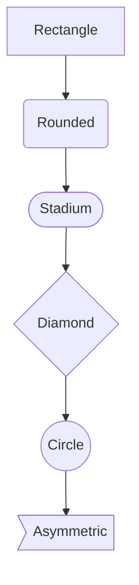
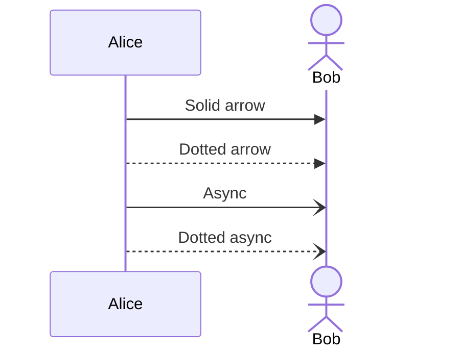
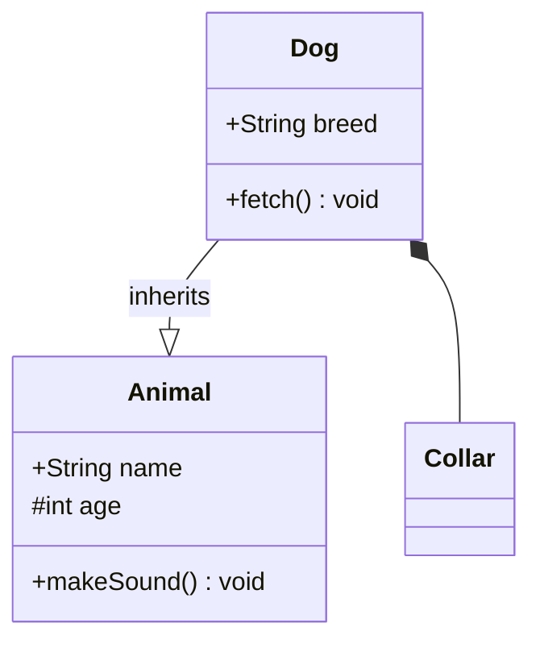
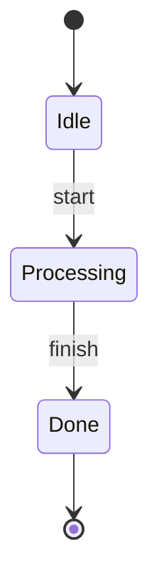
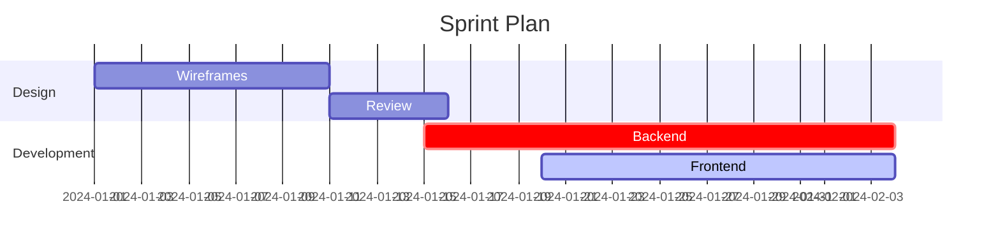
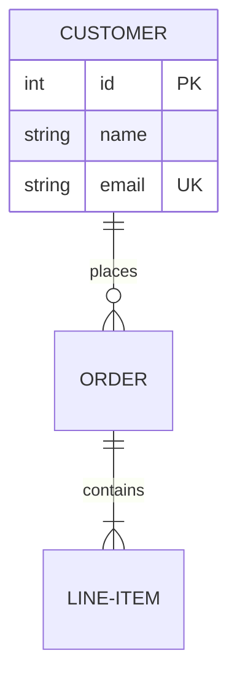
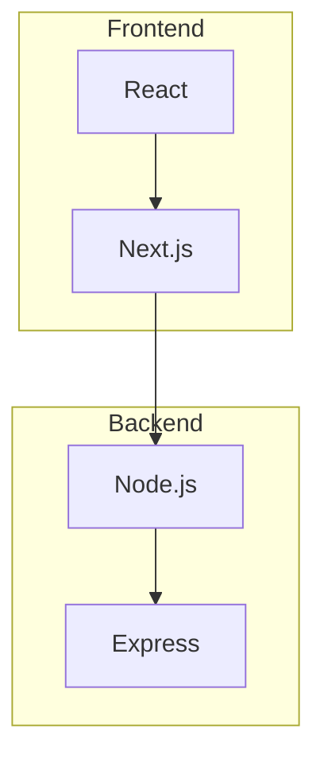
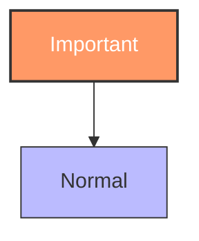

# Mermaid-iOS

Pure Swift Mermaid diagram renderer — no JavaScript, no WKWebView, no external dependencies.

Parses [Mermaid](https://mermaid.js.org/) diagram syntax and renders to `CGImage` using CoreGraphics.

> **See also**: [Mermaid-Android](https://github.com/hggz/Mermaid-Android) — the Kotlin companion library with feature parity.


## Features

- **Zero dependencies** — pure Swift + CoreGraphics, no CocoaPods/SPM packages needed
- **No WebView** — renders natively, works in background threads and extensions
- **7 diagram types**: Flowcharts, Sequence Diagrams, Pie Charts, Class Diagrams, State Diagrams, Gantt Charts, ER Diagrams
- **Flowcharts**: 7 node shapes, 4 edge styles, edge labels, all 5 directions, subgraph support
- **Class diagrams**: Classes with properties/methods, visibility modifiers, 6 relationship types, cardinalities, annotations
- **State diagrams**: States, transitions, start/end markers, labels, descriptions
- **Gantt charts**: Sections, tasks with statuses (done/active/critical), dependencies, date formatting
- **ER diagrams**: Entities with typed attributes (PK/FK/UK keys), crow's foot notation, 4 cardinality types
- **Sequence diagrams**: Participants, actors, 6 message arrow styles, lifelines
- **Pie charts**: Titled, decimal values, color-coded slices with legend
- **Style directives**: `classDef`, `class`, `style`, `:::className` for custom node styling
- **Dark mode**: Built-in dark color scheme via `MermaidSwift.darkMode`
- **Edge routing**: Liang-Barsky line-rectangle intersection algorithm to route edges around obstacles
- **PNG export**: Render directly to `Data` for saving or sharing
- **2x Retina rendering** out of the box

## Installation

### Swift Package Manager

Add to your `Package.swift`:

```swift
dependencies: [
    .package(url: "https://github.com/hggz/Mermaid-iOS.git", from: "1.0.0")
]
```

Then add `MermaidSwift` to your target dependencies:

```swift
.target(
    name: "YourApp",
    dependencies: ["MermaidSwift"]
)
```

Or in Xcode: **File → Add Package Dependencies** → paste `https://github.com/hggz/Mermaid-iOS.git`

## Quick Start

### Requirements

- Xcode 16+ 
- iOS 17+
- [xcodegen](https://github.com/yonaskolb/XcodeGen) (`brew install xcodegen`)

### Setup

```bash
git clone https://github.com/hggz/Mermaid-iOS.git
cd Mermaid-iOS
xcodegen generate
open MermaidRenderer.xcodeproj
```

Build and run (⌘R) on any iOS 17+ simulator.

### Headless Build & Run

```bash
# Generate project
xcodegen generate

# Build
xcodebuild build \
  -scheme MermaidRenderer \
  -destination 'platform=iOS Simulator,name=iPhone 17' \
  -derivedDataPath build

# Boot simulator, install, and launch
xcrun simctl boot 'iPhone 17' 2>/dev/null
xcrun simctl install booted build/Build/Products/Debug-iphonesimulator/MermaidRenderer.app
xcrun simctl launch booted com.microsoft.tools.MermaidRenderer
```

## API Usage

### Render to CGImage

```swift
import MermaidSwift

let renderer = MermaidSwift()

let image: CGImage = try renderer.render("""
flowchart TD
    A[Start] --> B{Decision}
    B -->|Yes| C[Do something]
    B -->|No| D[Do something else]
""")
```

### Render to PNG Data

```swift
let pngData: Data = try renderer.renderToPNG("""
pie title Languages
    "Swift" : 60
    "Kotlin" : 25
    "Other" : 15
""")

try pngData.write(to: URL(fileURLWithPath: "diagram.png"))
```

### Parse Only (inspect the AST)

```swift
let diagram = try renderer.parse("""
sequenceDiagram
    Alice->>Bob: Hello
    Bob-->>Alice: Hi back
""")

if let seq = diagram as? SequenceDiagram {
    print(seq.participants)  // ["Alice", "Bob"]
    print(seq.messages.count) // 2
}
```

### Custom Configuration

```swift
var config = LayoutConfig()
config.nodeWidth = 180
config.nodeHeight = 50
config.horizontalSpacing = 80
config.verticalSpacing = 60
config.fontSize = 16
let renderer = MermaidSwift(config: config)
let image = try renderer.render("flowchart TD\n    A --> B")
```

### Dark Mode

```swift
let darkRenderer = MermaidSwift.darkMode
let image = try darkRenderer.render("""
graph TD
    A[Hello] --> B[Dark World]
""")
```

### Class Diagrams

```swift
let image = try MermaidSwift().render("""
classDiagram
    class Animal {
        +String name
        +makeSound() void
    }
    class Dog {
        +String breed
        +fetch() void
    }
    Dog --|> Animal
""")
```

### State Diagrams

```swift
let image = try MermaidSwift().render("""
stateDiagram-v2
    [*] --> Idle
    Idle --> Processing : start
    Processing --> Done : finish
    Done --> [*]
""")
```

### Gantt Charts

```swift
let image = try MermaidSwift().render("""
gantt
    title Sprint Plan
    dateFormat YYYY-MM-DD
    section Design
        Wireframes :a1, 2024-01-01, 10d
        Review     :after a1, 5d
    section Dev
        Backend    :crit, 2024-01-15, 20d
""")
```

### ER Diagrams

```swift
let image = try MermaidSwift().render("""
erDiagram
    CUSTOMER ||--o{ ORDER : places
    ORDER ||--|{ LINE-ITEM : contains
    CUSTOMER {
        int id PK
        string name
        string email UK
    }
""")
```

## Supported Syntax

### Flowcharts

<table>
<tr><th>Mermaid.js (GitHub)</th><th>MermaidSwift (Native)</th></tr>
<tr>
<td>



</td>
<td>

</td>
</tr>
</table>

| Direction | Meaning |
|-----------|---------|
| `TD` / `TB` | Top → Down |
| `BT` | Bottom → Top |
| `LR` | Left → Right |
| `RL` | Right → Left |

| Edge Style | Syntax |
|------------|--------|
| Solid arrow | `-->` |
| Dotted arrow | `-.->` |
| Thick arrow | `==>` |
| Open (no arrow) | `---` |

### Sequence Diagrams

<table>
<tr><th>Mermaid.js (GitHub)</th><th>MermaidSwift (Native)</th></tr>
<tr>
<td>



</td>
<td>

</td>
</tr>
</table>

### Pie Charts

<table>
<tr><th>Mermaid.js (GitHub)</th><th>MermaidSwift (Native)</th></tr>
<tr>
<td>


</td>
<td>

</td>
</tr>
</table>

### Class Diagrams



| Relationship | Syntax | Marker |
|-------------|--------|--------|
| Inheritance | `<\|--` or `--\|>` | Triangle arrow |
| Composition | `*--` | Filled diamond |
| Aggregation | `o--` | Open diamond |
| Association | `-->` | Arrow |
| Dependency | `..>` | Dashed arrow |
| Realization | `..\|>` | Dashed triangle |

### State Diagrams



### Gantt Charts



| Task Status | Syntax |
|------------|--------|
| Normal | *(default)* |
| Done | `done` |
| Active | `active` |
| Critical | `crit` |

### ER Diagrams



| Cardinality | Left | Right | Meaning |
|------------|------|-------|---------|
| Exactly one | `\|\|` | `\|\|` | One and only one |
| Zero or one | `\|o` | `o\|` | Zero or one |
| Zero or more | `o{` | `}o` | Zero or more |
| One or more | `\|{` | `}\|` | One or more |

### Subgraphs



### Style Directives



## Architecture

```
Sources/MermaidSwift/
├── Model/DiagramModel.swift      # Diagram AST types (7 diagram models)
├── Parser/MermaidParser.swift     # Mermaid DSL → Model (regex-based)
├── Layout/DiagramLayout.swift     # Model → positioned elements + edge routing
├── Renderer/DiagramRenderer.swift # Positioned elements → CGImage (CoreGraphics)
└── MermaidSwift.swift             # Public API facade
```

**Pipeline**: Text → Parse → Layout → Render → CGImage

| Stage | What it does |
|-------|-------------|
| **Parse** | Regex-based parser converts Mermaid text into typed diagram models (7 types) |
| **Layout** | Topological sort, grid layout, edge routing (Liang-Barsky), dark mode config |
| **Render** | CoreGraphics bitmap context at 2x scale with shapes, arrows, markers, and text |

## Tests

112 tests across 4 suites — all passing:

```bash
swift test
```

| Suite | Tests | Coverage |
|-------|-------|----------|
| `MermaidParserTests` | 60 | All 7 diagram types, node shapes, edge styles, subgraphs, style directives, cardinalities |
| `DiagramLayoutTests` | 15 | Layout algorithms for all diagram types, dark mode config, edge routing |
| `DiagramRendererTests` | 15 | Image generation for all types, PNG export, shapes, dark mode |
| `MermaidSwiftIntegrationTests` | 22 | End-to-end parse → render → PNG for all diagram types |

## Roadmap

- [x] Flowcharts (7 shapes, 4 edge styles, 5 directions)
- [x] Sequence diagrams (participants, actors, 6 arrow styles)
- [x] Pie charts (titled, colored slices, legend)
- [x] Class diagrams (properties, methods, 6 relationship types, annotations)
- [x] State diagrams (states, transitions, start/end markers)
- [x] Gantt charts (sections, task statuses, dependencies)
- [x] ER diagrams (entities, attributes with keys, crow's foot notation)
- [x] Subgraph support (named groups in flowcharts)
- [x] Style/theme directives (`classDef`, `class`, `style`, `:::className`)
- [x] Dark mode rendering (`MermaidSwift.darkMode`)
- [x] Swift Package Manager support
- [x] Edge routing (Liang-Barsky intersection algorithm)
- [ ] Mindmap diagrams
- [ ] Timeline diagrams
- [ ] Git graph diagrams
- [ ] Click/link interactivity
- [ ] Theming engine (CSS variable-based themes)
- [ ] SVG export
- [ ] Accessibility labels for rendered elements

## Contributing

See [CONTRIBUTING.md](CONTRIBUTING.md) for guidelines. PRs welcome!

## License

[MIT](LICENSE)
